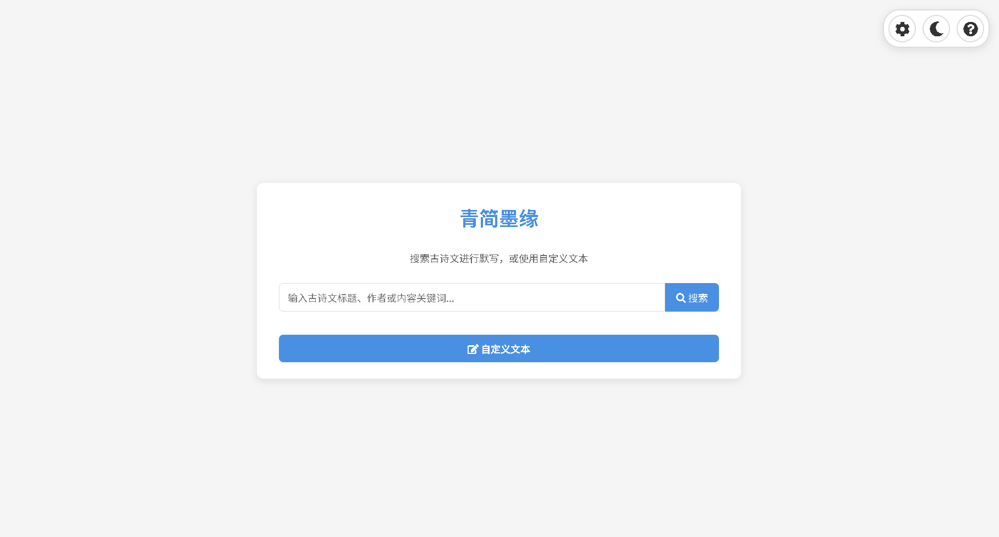
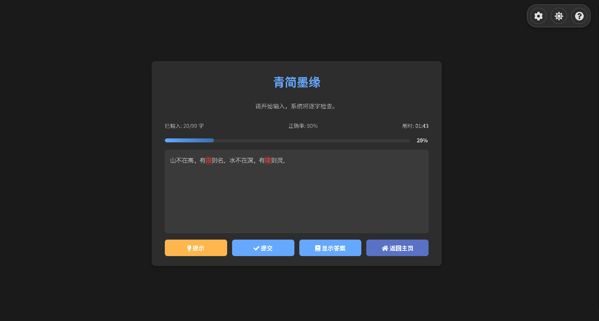
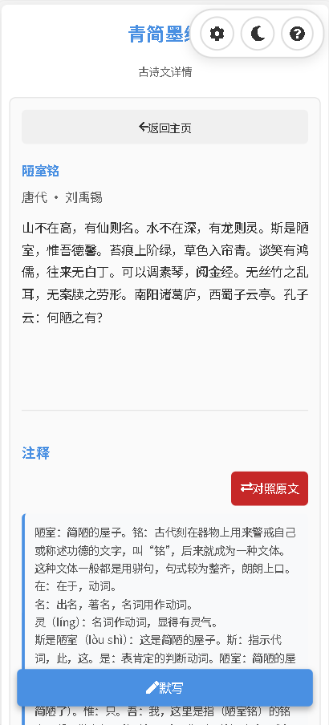
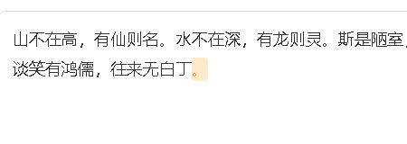
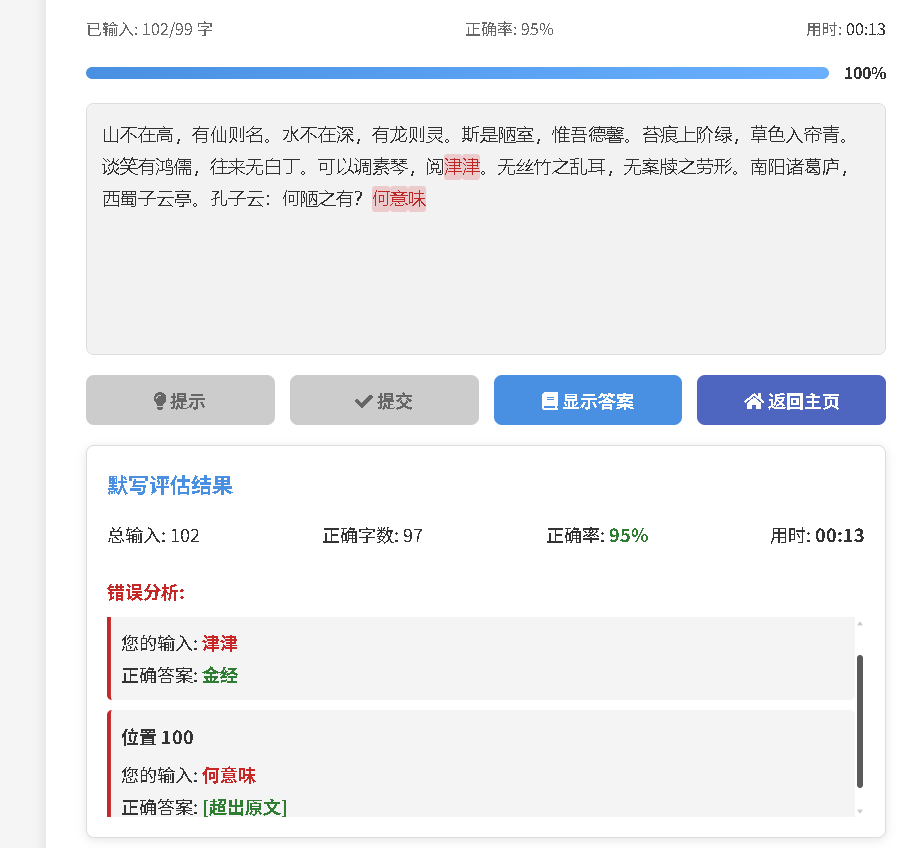

# 🖊️ 青简墨缘 (Qingjian Moyuan)

> **“青简传古韵，墨缘写诗心”**
>
> 一个优雅、现代化的古诗文默写与练习平台。

     

**青简墨缘** 是一个专注于古诗文默写的渐进式 Web 应用 (PWA)。它旨在通过沉浸式的交互体验，帮助用户加深对古典文学的记忆与理解。无论是备考学生还是诗词爱好者，都能在这里找到纯粹的练字心境。

## 🔗 在线体验

**[👉 点击立即访问 (Github Page)](https://herobrinein.github.io/qingjianmoyuan/)**

**[👉 国内可以用这个](https://s4.v100.vip:60888/recite.html)**

## 📸 界面预览

| 桌面端 - 浅色主页 |
| :---: |
|  |

| 桌面端 - 深色默写 |
| :---: |
|  |

| 移动端 - 详情页 | 设置与缓存管理 |
| :---: | :---: |
|  |  |

## 🤝 贡献与致谢

本项目凝聚了多方的创意与努力：

*   **创意构思**：[@胡思乱想Hero](https://space.bilibili.com/470347297)
*   **数据来源**：本项目的核心诗词数据来源于 **[chinese-gushiwen](https://github.com/caoxingyu/chinese-gushiwen)** 开源数据集，特此感谢作者 [@caoxingyu](https://github.com/caoxingyu) 的整理与贡献。
*   **核心开发**：[@DeepSeek-v3.2](https://chat.deepseek.com)，[@Gemini-3-Pro](https://aistudio.google.com)， [@Grok-4](https://grok.com)

## ✨ 核心功能

### 📝 智能默写系统
*   **实时校验**：输入过程中即时比对，正确显示黑色/白色，错误实时标红。

*   **智能辅助**：
    *   **自动填充**：自动识别并填充标点符号，让你专注于汉字书写。
	
    *   **提示功能**：遇到生僻字可点击提示（支持次数限制或无限模式）。
    *   **即时搜索**：支持按标题、作者或诗句关键词快速查找。
*   **限时挑战**：支持自动计算建议时长或自定义倒计时，模拟考试环境。
*   **结果评估**：完成后生成详细报告，包括正确率、用时及错误字词的精准定位。

### 🎨 极致的 UI/UX 体验
*   **深色模式 (Dark Mode)**：完美适配系统主题，支持手动一键切换，夜间练字更护眼。
*   **响应式设计**：
    *   **桌面端**：宽屏布局，悬浮工具栏。
    *   **移动端**：精心优化的触摸操作栏，底部快捷键，防止输入法遮挡。
*   **沉浸式背景音**：内置古典音乐播放器，支持歌词显示、音量对数调节、进度拖拽及后台播放。
*   **庆祝动画**：默写 100% 正确时触发五彩纸屑 (Confetti) 庆祝特效。

### ⚙️ 个性化设置

点击页面右上角的 设置 (⚙️) 图标，你可以自定义：
*   **常规**：背景音乐开关、系统主题跟随。
*   **搜索**：即时搜索、仅按标题搜索、结果折叠。
*   **默写**：
    *   **自动填充**：是否自动填入标点。
    *   **实时纠错**：输入时是否立即显示红字。
    *   **提示限制**：设置 0-5 次或无限提示。
*   **缓存**：设置 MP3 最大缓存数量，管理离线数据。
*   **更多设置**

### 🚀 技术特性 (PWA)

*   **离线可用**：基于 Service Worker 的缓存策略，无网络也能打开网页进行练习。
*   **缓存管理**：
    *   可视化的缓存统计（文件数、占用空间）。
    *   支持手动清理 MP3 缓存以节省设备空间。
    *   智能的资源更新机制。
*   **原生体验**：支持添加到桌面，像原生 App 一样运行。

## 🛠️ 技术栈

本项目是一个纯前端项目，无需后端数据库，轻量高效。

*   **核心**：HTML5, CSS3 (Flex/Grid), JavaScript (ES6+)
*   **PWA**：Service Worker, Cache API, Manifest
*   **图标库**：Font Awesome 5
*   **音频处理**：jsmediatags (用于读取 MP3 内嵌封面)
*   **数据存储**：LocalStorage (用户设置), IndexedDB/CacheStorage (离线资源)

---